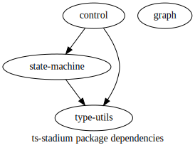

# ts-stadium

[API](https://no-day.github.io/ts-stadium) | [Blog with Demos](https://no-day.github.io/ts-stadium/demo)

Write typesafe state machines and get them visualized.

## Libraries

| Package                                                                                                     | Info |
| ----------------------------------------------------------------------------------------------------------- | ---- |
| [@ts-stadium/control](https://github.com/no-day/ts-stadium/tree/main/packages/external/control)             |      |
| [@ts-stadium/graph](https://github.com/no-day/ts-stadium/tree/main/packages/external/graph)                 |      |
| [@ts-stadium/state-machine](https://github.com/no-day/ts-stadium/tree/main/packages/external/state-machine) |      |
| [@ts-stadium/type-utils](https://github.com/no-day/ts-stadium/tree/main/packages/external/type-utils)       |      |

## Links

Bla
